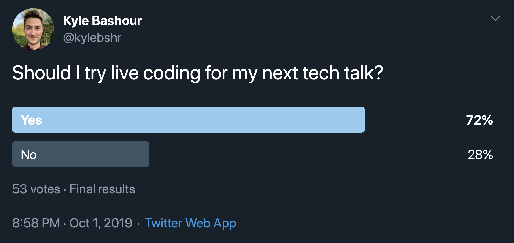
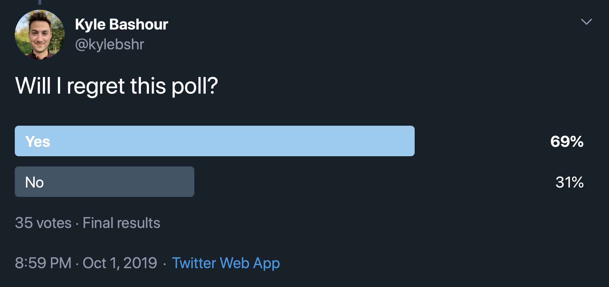

# Context Menus
## **From basics to polish**

---

[.background-color: #18202a]

---

[.background-color: #18202a]

---

> ...use context menus to give people access to additional functionality related to onscreen items without cluttering the interface.

\- Human Interface Guidelines

---

[.background-color: #fafafa]

---

# **Let’s do it!**

---
