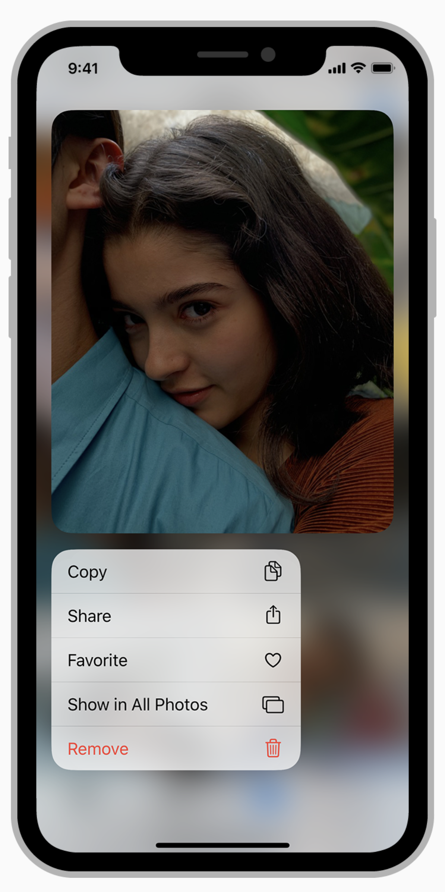

footer: **@kylebshr**
theme: Fira, 3
footer-style: alignment(right), text-scale(1.5)

[.hide-footer]

# Context Menus
## **From basics to polish**

^ Welcome everyone! Thank you so much for coming. First time in the office in 6 months, feels great to be back. Skiing accident, broke my back, story for another time.

^ Here to talk about context menus!

---

[.background-color: #fafafa]
[.footer-style: color(#333)]



---

> ...use context menus to give people access to additional functionality related to onscreen items without cluttering the interface.

\- Human Interface Guidelines

---

[.background-color: #18202a]


---

[.background-color: #18202a]


---

# **Let’s do it!**

---

# **Catalyst**

^ Would love to live code this, but IT hasn’t approved Catalina

---

[.hide-footer]
[.background-color: #fff]


^ For the most part, it really just works! 

^ But, no previews. It highlights based on the preview target.

---

```swift
private func makePhotoPreview(
	for configuration: UIContextMenuConfiguration) -> UITargetedPreview? 
{
    
    #if targetEnvironment(macCatalyst)

    return nil

    #else

    // Return normal preview...

    #endif
}
```

^ Better to just return nil

---

[.hide-footer]
[.background-color: #fff]


^ Voila

---

# **Recap**

## Basics

---

## Add a `UIContextMenuInteraction` to your view 

### (unless it's a table or a collection)

---

## Build your menu using `UIContextMenuConfiguration`

### (and don't use index paths as identifiers!)

^ and, that's all it really takes! There's no excuse not at add these where appropiate

---

# ✨ _**Polish**_ ✨

---

## Use nested `UIMenu` objects for submenus

---

## Add custom previews with `previewProvider`

### (but maybe not on macOS)

---

## Polish your preview animation with a `UITargetedPreview`

---

## Customize your targeted preview with `UIPreviewParameters`

---

## Polish commit animations with `preferredCommitStyle`

### `animator.preferredCommitStyle = .dismiss`

^ And with that, I'll set my own animation style to dismiss - because that's all I've got for your tonight!

---

# Resources

Twitter: @kylebshr

github.com/kylebshr/recipes

kylebashour.com/posts/context-menu-guide

developer.apple.com/design/human-interface-guidelines/ios/controls/context-menus/


